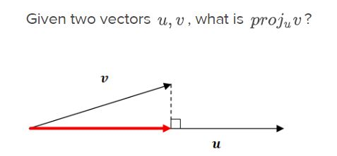
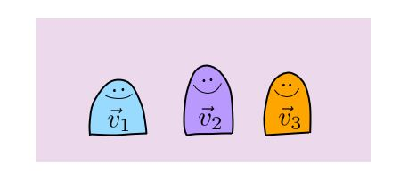

```{r setup, include=FALSE}
knitr::opts_chunk$set(echo = TRUE)
library(expm) 
library(pracma)
library(far)
library(Matrix)
```


# Review

- Let $\vec{y}$, $\vec{v_1}$ and $\vec{v_2} \in R^m$ (this refers to m dimensional space where each elements is real number)

- Suppose you can express $\vec{y}$ as linear combination of $\vec{v_1}$ and $\vec{v_2}$ 

$$\vec{y} = c_1\vec{v_1} +c_2\vec{v_2}$$

- $c_1$ and $c_2$ can be viewed as weight of $\vec{v_1}$ and $\vec{v_2}$  <br><br>

- Above equation is also saying that $\vec{y}$ can be expressed as linear combination of $\vec{v_1}$ and $\vec{v_2}$ <br><Br>
- Above equation is also saying that $\vec{y} \in$ Span{$\vec{v_1}$, $\vec{v_2}$}

### Basis
- Basis refers to minimum set of vectors to span a subspace or space.
    - Basis are independent of each other
    - For a given subspace or space, there are $\infty$ number of set of basis
    - Basis are not unique.
    
### Orthogonal basis
- Refers to basis that are orthogonal to each other
- $\vec{v_1}$ and $\vec{v_2}$ are orthogonal, if $\vec{v_1}\vec{v_2} = 0$
- $\vec{v}$$\vec{v}^{\perp}=0$ 

### Orthonormal basis
- basis that are 
  - orthogonal
  - < $\vec{v_i}$,$\vec{v_i}$ > = 1  for all basis

\break

## Domain and Codomain

- Inverse matrix revisted
- Inverse function 
- preimage of 

For a given function, the set of all elements of the domain that are mapped into a given subset of the codomain; (formally) given a function $ƒ : X → Y$ and a subset $B ⊆ Y$, the set $ƒ^{−1}(B) = {x ∈ X : ƒ(x) ∈ B}$. 

\break

# Conditional Probablity example

In each week of a class, you are either caught up or behind.

- The probability that you are caught up in Week 1 is 0.7. 
- If you are caught up in a given week, the probability that you will be caught up in the next week is 0.7. 
- If you are behind in a given week, the probability that you will be caught up in the next week is 0.4. 
- **What is the probability that you are caught up in week 3?**

- `Identify as many ways to improve this proof as you can`:

## Conditional probability with not so good notation

- If you are caught up in a week, there are two possibilities for the previous week: caught up and behind. 
- Let $P(X)$ be the probability of being caught up.  
  - In week 1, the probability of being caught up $P(X) = .7$.  
  - In week 1, the probability of being behind is $P(Y) = 1 - .7 = .3$.  

- We first break down the probability for week 2:
$$P(X) = .7 \cdot .7 + .3 \cdot .4 = .61$$

Now we can repeat the process for week 3:

$$P(X) = .61 * .7 + .39 * .4 = .583$$


- Let $C_i$ be the event that you are caught up in week $i$.
  - Given: 
    - $P(C_1) = 0.7$ 
    - $P(C_{i+1}|C_{i}) = 0.7$
    
- Let $C_i^C$ be the event that you are behind in week $i$
    - $P(C_{i+1}|C_i^C) = 0.4$. 
    

- `For week 2`, we can partition the sample space into $\{C_1, B_1 \}$ and apply the law of total probability:

$$\begin{aligned}
P(C_2) &= P(C_1)P(C_2|C_1) + P(B_1)P(C_2|B_1) \\
       &= 0.7 \cdot 0.7 + 0.3 \cdot 0.4 = 0.61
\end{aligned}$$

- Next, repeat the process for `week 3`:

$$\begin{aligned}
P(C_3) &= P(C_2)P(C_3|C_2) + P(B_2)P(C_3|B_2) \\
       &= 0.7 \cdot 0.61 + 0.39 \cdot 0.4 = 0.58
\end{aligned}$$

## Solving it using R

- You can write a function in R and solve it

```{r echo=FALSE, fig.height=4, fig.width=4}
caught_up <- function(weeks){
  ## we're going to hard-code the probabilities in here
  ## they could be taken as an argument if you wanted to generalize this 
  prob <- c(.7, rep(NA, weeks-1))
  week <- 1
  
  while(week < weeks) {
    prob[week+1] <- 0.7 * prob[week] + .4 * (1-prob[week])
    week <- week + 1
  }

  return(prob)
}

prob_caught_up <- caught_up(14)
plot(
  x = 1:length(prob_caught_up), y = prob_caught_up, 
  ylim = c(0.4, 0.8), 
  type = 'b', pch = 19, 
  xlab = 'Number of Weeks', ylab = 'P(Caught Up)', 
  main = 'Probability of Being Caught Up')
```

## Solving it using matrix

Given:
  - The probability of getting caught up with homework in this week only depends on the the outcome of the previous period.

- The transition matrix, $\mathbb{P}$, has nonzero values such that it is `regular` 

- Since  $\mathbb{P}$ is regular, it has limiting matrix

| | $C_i$ | $C_i^C$|
|:-:|:-:|:-:|
|$C_{i+1}$|0.7|0.4|
|$C_{i+1}^C$|||

- Above matrix contains the given information:
- Let $C_i$ be the event that you are caught up in week $i$.
    - $P(C_{i+1}|C_{i}) = 0.7$
- Let $C_i^C$ be the event that you are behind in week $i$
    - $P(C_{i+1}|C_i^C) = 0.4$. 

- Then, we can fill in the blank:

| | $C_i$ | $C_i^C$|
|:-:|:-:|:-:|
|$C_{i+1}$|0.7|0.4|
|$C_{i+1}^C$|`0.3`|`0.6`|

And if we multiply the above matrix by the initial state vector, see what you get

$$[0.7, 0.3]^T$$

```{r}

P <- matrix(c(0.7,0.4,0.3,0.6), nrow=2, byrow =T)  
print(P)

print(P%^%2)

print(P%^%1000)
```

## Solving it using eigenvalue

- Will talk about this more later in the class


```{r}
######################
# Using eignevalues
######################
myeigen <- eigen(P)    #gets you the eigenvalues and eigenvectors

## getting the eigenvalues and eigenvectors into vector and matrix.

lambda <- myeigen$values   #eigenvalues

E <- myeigen$vectors     #corresponding eigenvectors

print(lambda)
print(E)

p_vector <- function(x){
y <- sum(abs(x))
x <- abs(x)/y
return(x)
}

#converting the eigenvector corresponding to eigenvalue = 1
p_vector(E[,1])
```

# More about linear combination

## Definiations

### Linear combination 

$$\mathbb{A}\vec{x} = \vec{b}$$

### Subspace

- If $\vec{v}_1,..\vec{v}_p \in R^n$, then Span{$\vec{v}_1,..\vec{v}_p$} is called the subset of $R^n$ by these vectors.

### Linear combination, Projection and transformation

$$\mathbb{A}\vec{x} = \vec{b}$$
\break

# Projection 

$$\text{Proj}_{\vec{u}}{\vec{v}} = \frac{\vec{v}\vec{u}}{{||\vec{u}||}}$$
```{r echo=FALSE, fig.align='center', message=FALSE, warning=FALSE}

```

```{r echo=FALSE, fig.align='center', message=FALSE, warning=FALSE}

```

## example 1

```{r}
v <- c(3,4)
u <- c(5,-12)

p <- v%*%u/(t(u)%*%u)

p
```

## example 2

```{r}
v <- c(4,3)
u <- c(1,0)

p <- v%*%u/(t(u)%*%u)

p
```

## example 3

```{r}
v <- c(4,3)
u <- c(0,2)

p <- v%*%u/(t(u)%*%u)

p
```


```{r}
library(wooldridge)
library(tidyverse)
library(patchwork)

df <- wooldridge::bwght

glimpse(df)
unique(df$parity)

p1 <- df %>% filter(parity %in% c(1,2,3)) %>% ggplot(aes(x=bwght, y = faminc, color = factor(male))) + geom_point() + facet_wrap(~male)


p2 <- df %>% ggplot(aes(x=bwght, y = faminc, color = factor(male))) + 
       geom_point() + facet_wrap(~parity, ncol = 3)


p1/p2  
```


