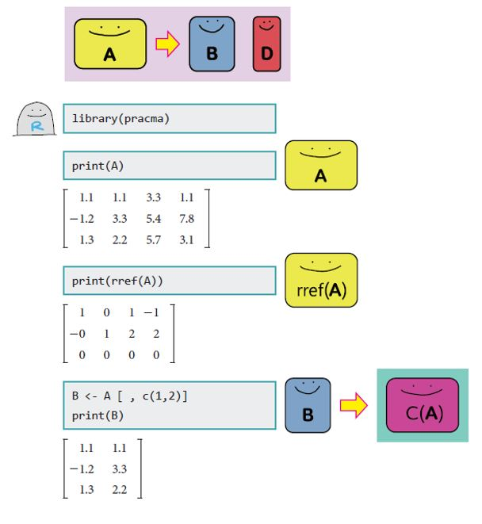
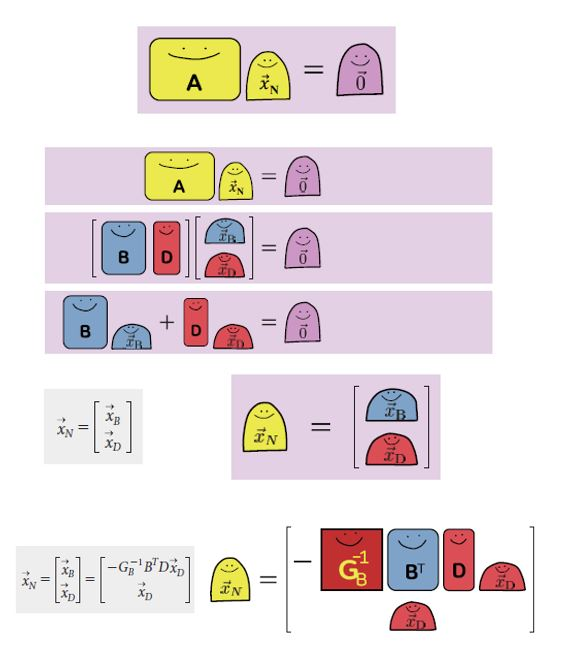
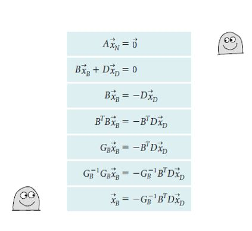

```{r setup, include=FALSE}
knitr::opts_chunk$set(echo = TRUE)
```

```{r message=FALSE}
library(far)
library(MASS)
library(pracma)
```

# Concepts

## Space, subspace

- Domain, codomain (Range, C($mathbb{A}$))

## Domain, codomain, Range

- You will see the following notation from time to time

$$T: R^n \rightarrow R^m $$

- the above notation is saying that `matrix T will be used to multiply vector with size of n and the resulting vector will have size m`

- And we will get into the details later.

- Vector resize within a space which consist of so many subspaces.

- When you put vectors into a matrix, you get two space, I call them `input` and `output space`.  Input space can be divided into `row space` and `nullspace`, and `output space` can be divided into `column space` and `left null space`

- Think of domain as `row space` and `codomain` as `output space` and `range` as `column space`

## Rank nullity theorem

If $\mathbb{A}$ has $n$ columns, then $\text{Rank}(\mathbb{A}) + \text{dim Nul}(\mathbb{A}) = n$

- see page 156 for the invertible matrix theorem (continued)

## Invertible Linear Transformation

- A linear transformation $\mathbb{T}: R^n \rightarrow R^n$ is said to be `invertible` if there exists a funciton $\mathbb{S}: R^n \rightarrow R^n$ such that 

$$\begin{aligned}
\mathbb{S}(\mathbb{T}(\vec{x}))= \vec{x} \text{ for all }\vec{x}\text{ in } R^n \\
\mathbb{T}(\mathbb{S}(\vec{x}))= \vec{x} \text{ for all }\vec{x}\text{ in } R^n \\
\end{aligned}$$
<br><br>
where dim($\mathbb{A}$) = n by n, $\vec{x}, \vec{b} \in R^n$
- $\mathbb{A}$ is the standard matrix for $\mathbb{T}$
$$\mathbb{A}\vec{x}=\vec{b}$$

- $\mathbb{A}^{-1}$ is the standard matrix for $\mathbb{S}$
$$\mathbb{A}^{-1}\vec{b}=\vec{x}$$

```{r}
r1 <- c(0,1,-4,5)
r2 <- c(2,-3,2,7)
r3 <- c(5,-8,9,10)
r4 <- c(15,-18,19,10)
A <- rbind(r1,r2,r3,r4)
print(A)

Rank(A)

print(rref(A))
```
- Above matrix is invertible matrix based on `rref()`
- Inverse transformation `undo` the transformation

```{r}
x <- c(3,6,9)

#to use the same notation
T <- A
b<- T%*%x
print("Before the transformation")
print(x)
print("After the transformaiton")
print(T%*%x)
```

## When $\mathbb{A}$ is not a square matrix

- With respect to $\mathbb{A}$, $\vec{b}$ is in your `range` and $\vec{x}$ is in `domain`.

- $\mathbb{A}$ transform vectors in domain to range.
- $\mathbb{A}^{-1}$ can transform values in range back to domain, when the $\mathbb{A}$ involved 1-1 transformation.

```{r}
#chapter 1.1 example 3

r1 <- c(0,3,-6,6,4,-5)
r2 <- c(3,-7,8,-5,8,9)
r3 <- c(3,-9,12,-9,6,15)

A <- rbind(r1,r2,r3)
print(A)
Rank(A)
rref(A)

B <- A[,c(1,2,5)]
print(B)
inv(B)
```

## Exercise.  

- Get 5 matrices from class 
- Given a matrix and a vector
  - Show different ways of spanning the given vector

```{r}
print(A)
Rank(A)

b <- c(1.2,5.23,-9)

Rank(A)

H <- cbind(A,b)
Rank(H)

rref(A)

B  <- A[,c(1,2,5)]
print(B)

x_B<- inv(B)%*%b
x_B
B%*%x_B
dim(A)
A%*%c(-38,-9,0,0,7,0)
```


```{r}
r1 <- c(0,3,-6,6,4,-5)
r2 <- c(3,-7,8,-5,8,9)
r3 <- c(3,-9,12,-9,6,15)
r4 <- c(1,3,5,6,7,-1,10)

A <- rbind(r1,r2,r3,r4)
print(A)
dim(A)
Rank(A)

#selecting random combiantion
x <- c(1,2,3,4,5,6,7)

b <- A%*%x
b

#getting only the basis vectors
B <- A[,c(1,2,3,5)]
x_B <- inv(B)%*%b

B%*%x_B

#another problem

rref(A)

B <- A[,c(1,2,3,5)]
Rank(B)
dim(B)
inv(B)
cond(B)

b <- c(0.1, -1.5, 1,-1000)

x_B <- inv(B)%*%b

B%*%x_B

```

# How to find basis of fundamental four subspaces

```{r echo=FALSE, fig.align='center', message=FALSE, warning=FALSE}

```

```{r echo=FALSE, fig.align='center', message=FALSE, warning=FALSE}

```

```{r echo=FALSE, fig.align='center', message=FALSE, warning=FALSE}

```
  
  
```{r}
r1 <- matrix(c(1.1,1.1,3.3,1.1), nrow =1)
r2 <- matrix(c(-1.2,3.3,5.4,7.8), nrow =1)
r3 <- matrix(c(1.3,2.2,5.7,3.1), nrow =1)
A <- rbind(r1,r2,r3)
print(A)

print(rref(A))
Rank(A)

B <- A[,c(1,2)]
print(B)

D <- A[,-c(1,2)]
print(D)

GB <- t(B)%*%B
print(GB)

print(-inv(GB)%*%t(B)%*%D)
I <- diag(2)
print(I)

print(rbind(-inv(GB)%*%(t(B)%*%D),I))

N <- rbind(-inv(GB)%*%(t(B)%*%D),I)
print(round(A%*%N,2))
```


# Projection Matrix (preview)

$$\mathbb{I} - \mathbb{P} = \mathbb{P}^{\perp}$$

```{r}
r1 <- matrix(c(1.1,1.1,3.3,1.1), nrow =1)
r2 <- matrix(c(-1.2,3.3,5.4,7.8), nrow =1)
r3 <- matrix(c(1.3,2.2,5.7,3.1), nrow =1)
A <- rbind(r1,r2,r3)
print(A)
Rank(A)
rref(A)

b <- A[,c(1)] + A[,c(2)] + c(2.2,2.1,0)
b

B <- A[,c(1,2)]

Ab <- cbind(B,b)

Rank(Ab)
```

$$\begin{aligned}
\mathbb{B}\vec{x}_b + \mathbb{B}^{\perp}\vec{x}_b^{\perp}&=\vec{b}\\
\mathbb{B}^T\mathbb{B}\vec{x}_b &= \mathbb{B}^T\vec{b}\\
(\mathbb{B}^T\mathbb{B})^{-1}\mathbb{B}^T\mathbb{B}\vec{x}_b &= (\mathbb{B}^T\mathbb{B})^{-1}\mathbb{B}^T\vec{b}\\
\vec{x}_b &= (\mathbb{B}^T\mathbb{B})^{-1}\mathbb{B}^T\vec{b}
\end{aligned}$$

- this is projection matrix

$$\mathbb{P}=\mathbb{B}(\mathbb{B}^T\mathbb{B})^{-1}\mathbb{B}^T$$

```{r}
print(B)
print(b)

P <- 

x_B <- inv(t(B)%*%B)%*%t(B)%*%b

P<- B%*%inv(t(B)%*%B)%*%t(B)

#the best you can do within C(A)
estimate <- B%*%x_B

#this is residual not error 
residual <- b-B%*%inv(t(B)%*%B)%*%t(B)%*%b

#b
estimate + residual

estimate
P%*%b

# breaking it down
P_ortho <- diag(3)-P
P%*%b + P_ortho%*%b
b
```


  
  
  
